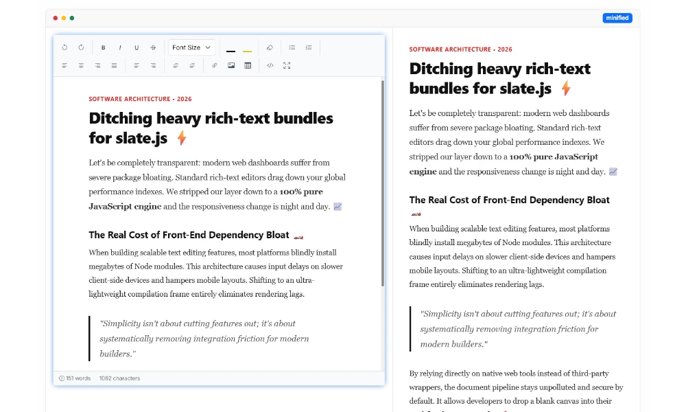

# slate.js


[](https://opensource.org/licenses/MIT)

`slate` is an ultra-lightweight client-side JavaScript module that transforms standard textareas into an elegant, real-time live preview canvas. It strips away the bloat of traditional rich-text editors to give developers a simple vanilla JavaScript fully-featured HTML editor.

## Contents
- [Key Features](#-key-features) 
- [Live Demo](#-live-demo)
- [Quick Start](#-quick-start)
    - [API & Events](#api--events)
    - [Theming & Dark Mode](#theming--dark-mode)
    - [Toolbar Buttons](#toolbar-buttons)
- [Development Installation](#development-installation)
- [Contributing](#-contributing)


## screenshot


---

## ✨ Key Features

- **Bootstrap 5 Native** – Integrates flawlessly into existing Bootstrap themes, forms, and grid layouts.
- **Pure ESM**: Built from the ground up using native ES Modules.
- **Featherlight Footprint** – Lightweight and built with zero external dependencies.
- **Extensible**: Simple API to add custom toolbar buttons and behaviors.
- **Fully Themeable** – Styled with simple CSS custom properties to match your application's design language.

### Editor Feature
- **Rich Formatting:** bold, italic, underline, strike-through, font family/size, text/background color, clear formatting.
- **Layout Tools:** unordered/ordered lists, alignment controls, block & inline direction (LTR/RTL) switches, custom tables.
- **Insertions:** links, images, tables, code view toggle, fullscreen mode, HTML export helper.
- **Productivity:** undo/redo history, keyboard shortcuts, multilingual tooltips and modals, status bar with word/character counts.

---

## 🚀 Live Demo

Check out the interactive playground and see the minimalist architecture in action:
👉 **[Launch Live Demo & Documentation](https://slate.infinityfree.io)**

---

## 📦 Quick Start

### 1. Include script and styles
Add the `ngen-press` script bundle directly and CSS styles into your HTML file:

```
<link href="./css/slate.css" rel="stylesheet">
...
<script src="./js/slate.min.js"></script>
```

### 2. Setup Your HTML Structure
Define a native textarea element and a matching preview container:

```html
<div class="row">
  <div class="col-md-6">
    <textarea id="slate-editor" class="form-control" name="content"><!-- Your initial HTML --></textarea>
  </div>
  <div class="col-md-6">
    <div id="slate-preview"></div>
  </div>
</div>
```

### 3. Initialize the editor
Hook `ngen-press` to your DOM nodes using standard vanilla JavaScript initialization:

```javascript
const textarea = document.getElementById('slate-editor');
const editor = new Slate(textarea, {
    onChange: function(content) {
        document.gentElementById('slate-preview').innterHTML = content;
    }
});
```

That’s it! The editor replaces the textarea in-place and stores the HTML output alongside the original element for form submissions.

---


## Theming & Dark Mode

- Toolbar and content adapt automatically to light/dark mode via `theme-dark` class.
- Demo pages include a toggle that adds `body.dark-mode`, theming headings, buttons, code blocks, and the editor wrapper together.
- Code view and HTML preview force LTR direction, Consolas font, no left gutter, and sanitized indentation.

To switch at runtime:

```javascript
document.querySelector('.slate-canvas-wrapper').classList.toggle('theme-dark');
```

---

## Toolbar Buttons

| Category | Buttons |
|----------|---------|
| History | `undo`, `redo` |
| Style | `bold`, `italic`, `underline`, `strikethrough`, `removeFormat` |
| Fonts | `fontsize`, `forecolor`, `backcolor` |
| Paragraph | `insertUnorderedList`, `insertOrderedList`, `justifyLeft`, `justifyCenter`, `justifyRight`, `justifyFull` |
| Insert | `insertLink`, `insertImage`, `insertTable` |
| View | `codeView`, `fullscreen` |

Color pickers include a live indicator bar that mirrors the selected text/background color and resets when no color is applied.

---


## ⚙️ API Configuration

Customize the core instance by passing optional configuration parameters during initialization:


| Option | Type | Default | Description |
|--------|------|---------|-------------|
| `height` | string | `'400px'` | Height of the editable area. Accepts any valid CSS height. |
| `toolbar` | string \| array | `'full'` | `'full'`, `'basic'`, `'minimal'`, or custom nested array of button ids. |
| `fontFamilies` | array | internal defaults | Array of strings or `{displayName, value}` objects. Replaces defaults entirely. |
| `fontSizes` | array | `[1,2,3,4,5,6,7]` | Mapping onto browser font size levels (1–7). |
| `colors` | array | 64 preset hex values | Color palette for foreground/background pickers. |
| `showStatusBar` | boolean | `true` | Toggle status bar with word/character counts. |
| `placeholder` | string | `'Start typing…'` | Placeholder shown when editor is empty. |
| `onInit` | function | `null` | Callback fired after editor mounts. Receives editor instance. |
| `onChange` | function | `null` | Fired whenever content changes. Receives HTML string. |


Keyboard shortcuts: `Ctrl+B`, `Ctrl+I`, `Ctrl+U`, `Ctrl+Z`, `Ctrl+Y`, `Ctrl+Shift+Z`, `Tab` for indent, plus browser defaults for copy/cut/paste.

---


## API & Events

```javascript
// Instance methods
const slate = new Slate('textarea');
// Get engine content
let content = slate.getContent();
// Set content
slate.setContent('<p>Hello!</p>');
// Get text content
let contentText = slate.getText();
// Public methods
slate.clear();
slate.focus();
slate.disable();
slate.enable();
slate.destroy();
```


## 🔌 Listening to Engine Events

Natively dispatches standard custom events straight through your target `<textarea>` element. Handle state updates, blur metrics, and focus frames using standard vanilla JavaScript `addEventListener` blocks.

### Available Custom Events

| Event Name | Dispatched When | Event Detail Payload |
| :--- | :--- | :--- |
| `slate:change` | The user types and the canvas compiles | `e.detail.html` *(The current sanitized layout string)* |
| `slate:focus` | The user selects or enters the editor pane | `null` |
| `slate:blur` | The user clicks away or exits the text canvas | `null` |

### Implementation Example

To intercept these events, simply query your original native `<textarea>` and attach your listeners directly to it:

```javascript
// 1. Query your underlying form textarea node
const myTextArea = document.getElementById('slateEditor');

// 2. Instantiate the slate engine instance
const slate = new Slate(myTextArea, {
  onChange: (content) => {
    document.getElementById('slatePreview').innerHTML = content;
  }
});

// 3. Listen directly to custom lifecycle events on the textarea
myTextArea.addEventListener('slate:change', (e) => {
  // Grab the real-time compiled HTML payload instantly
  const updatedHTML = e.detail.content;
  console.log('Engine compiled updated content stream:', updatedHTML);
});

myTextArea.addEventListener('slate:blur', () => {
  console.log('User exited the editing canvas space.');
});
```

---


## Development Installation

Because this package utilizes a compilation step, you must clone the repository and build the assets locally to use it directly from source.

### 1. Clone the Repository
```bash
git clone https://github.com/n-genesis/slate
cd slate
```

### 2. Install Dependencies
```bash
npm install
```

### 3. Build the Assets
Compiles the source code into the production-ready `dist/` folder:
```bash
npm run build
```

---


## 🤝 Contributing

We welcome contributions from the open-source community to make web editing cleaner and faster. 

1. Fork the Project (`https://github.com/n-genesis/slate`)
2. Create your Feature Branch (`git checkout -b feature/AmazingFeature`)
3. Commit your Changes (`git commit -m 'Add some AmazingFeature'`)
4. Push to the Branch (`git push origin feature/AmazingFeature`)
5. Open a Pull Request

---

## 📄 License

Distributed under the MIT License. See `LICENSE` for more information.

Developed with love by [N-Gen Design](https://ngendesign.com).
